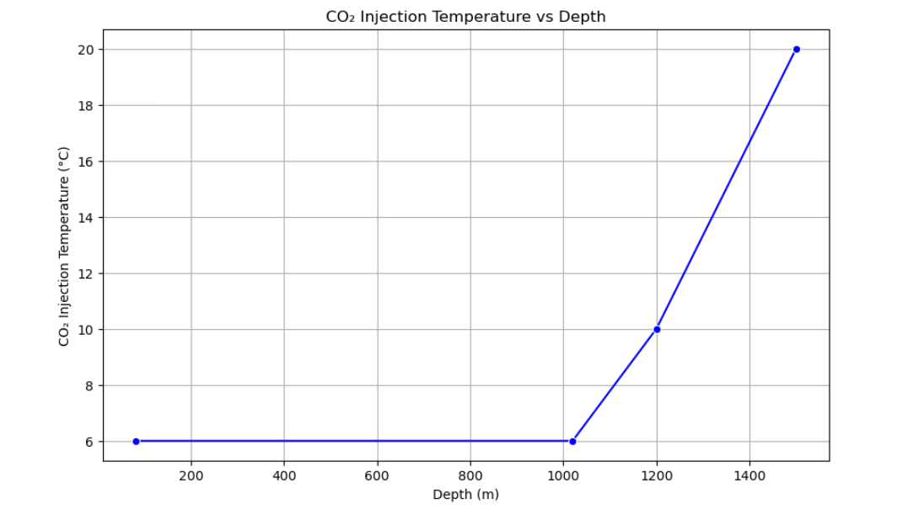
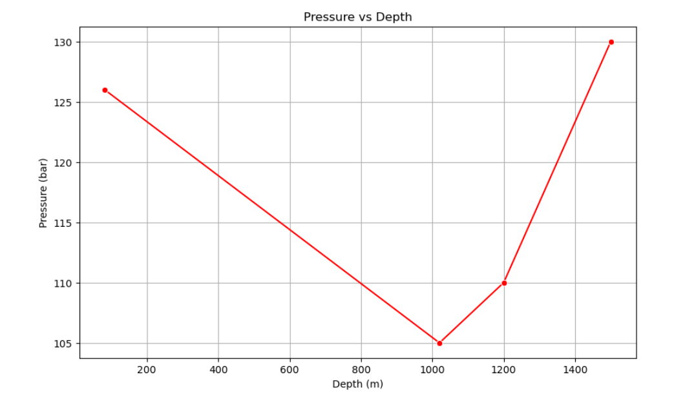
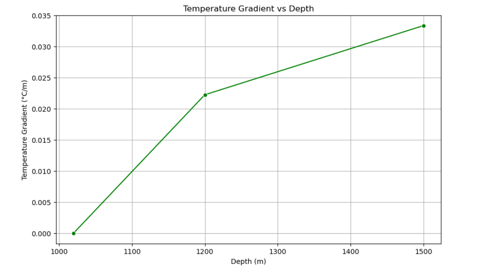
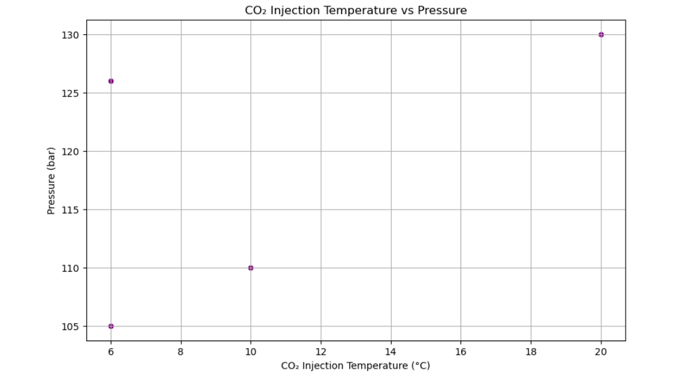

# CO₂ Injection Temperature Analysis in Geological Formations (Smeaheia Reservoir)

## Introduction
This project aims to analyze **CO₂ Injection Temperature** and **Pressure** in the **Smeaheia reservoir**, examining how these parameters vary with **depth** and how they influence the **effectiveness of CO₂ storage**. Understanding the thermal behavior of the reservoir is crucial for optimizing the CO₂ injection process and assessing the long-term sustainability of CO₂ storage. This project focuses on temperature gradients, pressure trends, and their relationship with depth.
---

### Data License
- The datasets used in this project are made available under **[Smeaheia Dataset License](https://co2datashare.org/smeaheia-dataset/static/SMEAHEIA%20DATASET%20LICENSE_Gassnova%20and%20Equinor.pdf)** by **Equinor** and **Gassnova**. You can use the data for research and non-commercial purposes while providing appropriate credit.

### Dataset Access

The dataset used in this project has been extracted and converted into an Excel file from the original Smeaheia dataset. The data includes **CO₂ Injection Temperature**, **Pressure**, and **Depth** readings, which were used for the analysis in the **Smeaheia Reservoir**.

#### How to Access the Dataset:
- The dataset is available in this repository under the **`data/`** folder. You can download it directly by navigating to the folder.
- **Dataset File**: `Smeaheia temperature and pressure.xlsx`
--- 

### Installation

If you need to run the project on your local machine, ensure you have the following Python libraries installed:

```bash
pip install pandas matplotlib seaborn scikit-learn
```

---

## Data Loading and Preprocessing

In this project, we start by loading the **temperature/pressure data**. The dataset provides the **CO₂ injection temperature** and **pressure** at different depths within the reservoir. The following preprocessing steps were taken:
- Loaded and cleaned the dataset.
- Checked for missing values and handled them appropriately.
- Selected relevant columns for analysis.
- The dataset was sorted by depth for consistent data representation.

```python
# Load temperature and pressure data 
Smeaheia_Norway_Temp_Pressure_data = pd.read_excel('data/Smeaheia pressure and temperature .xlsx')

# Display the first few rows to check if the columns are selected properly
Smeaheia_Norway_Temp_Pressure_data.head()

# Get a statistical summary of the dataset
summary_stats = Smeaheia_Norway_Temp_Pressure_data.describe()

# Display the summary
print(summary_stats)
```

---

## Exploratory Data Analysis (EDA)

In this section, we explore the relationships between **CO₂ Injection Temperature** and **depth**, as well as **Pressure** and **depth**. Various visualizations are used to uncover patterns and insights, such as temperature gradients and how they change with depth.

### Visualize CO₂ Injection Temperature vs Depth using a line plot

```python
# Visualize CO₂ Injection Temperature vs Depth using a line plot
plt.figure(figsize=(10, 6))
sns.lineplot(x=Smeaheia_Norway_Temp_Pressure_data['Depth (m)'], 
             y=Smeaheia_Norway_Temp_Pressure_data['CO₂ Injection T  (°C)'], 
             marker="o", color='b')
plt.title('CO₂ Injection Temperature vs Depth')
plt.xlabel('Depth (m)')
plt.ylabel('CO₂ Injection Temperature (°C)')
plt.grid(True)
plt.show()


```

### Visualize Pressure vs Depth using a line plot

```python
# Visualize Pressure vs Depth using a line plot
plt.figure(figsize=(10, 6))
sns.lineplot(x=Smeaheia_Norway_Temp_Pressure_data['Depth (m)'], 
             y=Smeaheia_Norway_Temp_Pressure_data['Pressure (bar)\t'], 
             marker="o", color='r')
plt.title('Pressure vs Depth')
plt.xlabel('Depth (m)')
plt.ylabel('Pressure (bar)')
plt.grid(True)
plt.show()


```

### Temperature Gradient Analysis

```python
# Calculate Temperature Gradient
Smeaheia_Norway_Temp_Pressure_data['Temperature Gradient'] = Smeaheia_Norway_Temp_Pressure_data['CO₂ Injection T  (°C)'].diff() / Smeaheia_Norway_Temp_Pressure_data['Depth (m)'].diff()

# Plot Temperature Gradient vs Depth
plt.figure(figsize=(10, 6))
sns.lineplot(x=Smeaheia_Norway_Temp_Pressure_data['Depth (m)'], 
             y=Smeaheia_Norway_Temp_Pressure_data['Temperature Gradient'], 
             marker="o", color='g')
plt.title('Temperature Gradient vs Depth')
plt.xlabel('Depth (m)')
plt.ylabel('Temperature Gradient (°C/m)')
plt.grid(True)
plt.show()


```

### Scatter plot of CO₂ Injection Temperature vs Pressure

```python
# Scatter plot of CO₂ Injection Temperature vs Pressure
plt.figure(figsize=(10, 6))
sns.scatterplot(x=Smeaheia_Norway_Temp_Pressure_data['CO₂ Injection T  (°C)'], 
                y=Smeaheia_Norway_Temp_Pressure_data['Pressure (bar)\t'], 
                color='purple')
plt.title('CO₂ Injection Temperature vs Pressure')
plt.xlabel('CO₂ Injection Temperature (°C)')
plt.ylabel('Pressure (bar)')
plt.grid(True)
plt.show()



# Calculate Pearson Correlation Coefficient between Temperature and Pressure
correlation = Smeaheia_Norway_Temp_Pressure_data['CO₂ Injection T  (°C)'].corr(Smeaheia_Norway_Temp_Pressure_data['Pressure (bar)\t']))

# Display the correlation
print(f"Pearson Correlation Coefficient between CO₂ Injection Temperature and Pressure: {correlation}")
```

---

## Insights from the Data

From the EDA and temperature gradient analysis, we derive several key insights:

- **CO₂ Injection Temperature** increases with **depth**, indicating a direct relationship between depth and temperature.
- **Pressure** generally decreases with depth, which is important for understanding CO₂ injection behavior.
- **Temperature Gradient Analysis** suggests varying temperature behavior in different parts of the reservoir, influencing the CO₂ injection process.
- The **scatter plot** shows a moderate positive correlation between **CO₂ Injection Temperature** and **Pressure**, suggesting some interdependency.

---

## Feature Engineering

An interaction term between **Depth** and **CO₂ Injection Temperature** was created to capture the combined effect of depth and temperature on CO₂ storage efficiency. Additionally, the **Pressure-Temperature** relationship was considered for further analysis.

```python
# Feature Engineering: Create an interaction term between Depth and CO₂ Injection Temperature
Smeaheia_Norway_Temp_Pressure_data['Depth-Temperature Interaction'] = Smeaheia_Norway_Temp_Pressure_data['Depth (m)'] * Smeaheia_Norway_Temp_Pressure_data['CO₂ Injection T  (°C)']
```

---

## Modeling and Prediction

We applied a **Linear Regression** model to predict **CO₂ Injection Temperature** based on **depth**. The model's performance was evaluated using **Mean Squared Error (MSE)** and **R-squared (R²)** scores. Due to the limited dataset (only four data points), the model's predictive performance was limited.

```python
# Prepare the data for modeling
X = Smeaheia_Norway_Temp_Pressure_data[['Depth (m)']]  # Predicting CO₂ Injection Temperature based on Depth
y = Smeaheia_Norway_Temp_Pressure_data['CO₂ Injection T  (°C)']

# Split the data into training and testing sets
X_train, X_test, y_train, y_test = train_test_split(X, y, test_size=0.2, random_state=42)

# Initialize the Linear Regression model
model = LinearRegression()

# Train the model
model.fit(X_train, y_train)

# Predict using the model
y_pred = model.predict(X_test)

# Evaluate the model
mse = mean_squared_error(y_test, y_pred)
r2 = r2_score(y_test, y_pred)

print(f"Mean Squared Error (MSE): {mse}")
print(f"R-squared (R²): {r2}")
```

---

## Conclusion 

The analysis of CO₂ Injection Temperature and Pressure in the Smeaheia reservoir reveals the following trends:
- **CO₂ Injection Temperature** increases with depth, which is important for CO₂ phase behavior and storage efficiency.
- **Pressure** decreases with depth, which is important for understanding the reservoir's behavior during CO₂ injection.
- Given the limited data (only 4 data points), machine learning models like linear regression were not effective. The results mainly provide descriptive insights rather than predictive models.
